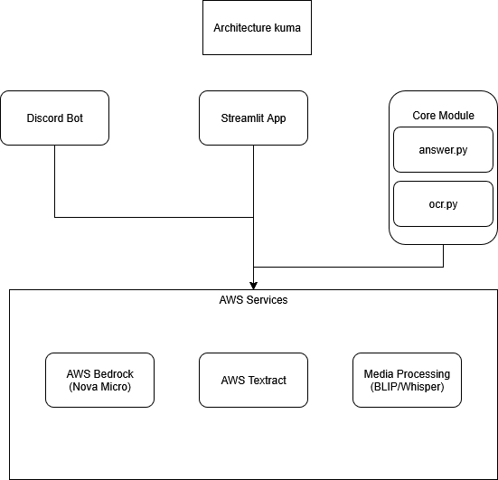
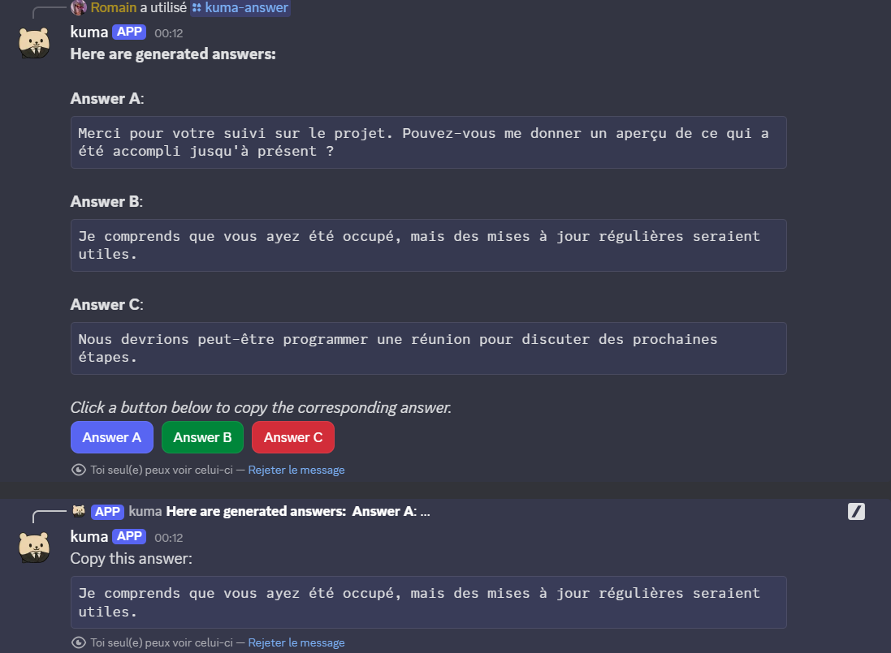

# Rapport de Projet : Kuma - Assistant IA pour Génération de Réponses Conversationnelles

## Table des matières

1. [Introduction](#introduction)
2. [Architecture générale](#architecture-générale)
3. [Composants principaux](#composants-principaux)
4. [Fonctionnalités détaillées](#fonctionnalités-détaillées)
5. [Interfaces utilisateur](#interfaces-utilisateur)
6. [Analyse technique](#analyse-technique)
7. [Gestion des médias](#gestion-des-médias)
8. [Intégration AWS](#intégration-aws)
9. [Défi et solutions](#défis-et-solutions)
10. [Conclusions et perspectives](#conclusions-et-perspectives)

---

## Introduction

**Kuma** est un agent IA innovant conçu pour recommander des réponses personnalisées à des messages en fonction de l'historique de conversation, du contexte et de l'émotion choisie par l'utilisateur. Ce projet combine plusieurs technologies de pointe pour créer une expérience utilisateur fluide et intelligente.

### Objectif du projet

Le projet vise à automatiser et améliorer la communication digitale en proposant des réponses contextuellement appropriées qui correspondent au ton et au sentiment souhaités. Kuma s'adapte à différentes plateformes de messagerie (Discord, iMessage, WhatsApp, Twitter) et peut traiter diverses formes de médias.

### Technologies utilisées

- **Python 3.12+** : Langage principal
- **AWS Bedrock** : Modèle de langage (Nova Micro)
- **AWS Textract** : OCR pour l'extraction de texte
- **Discord.py** : Bot Discord
- **Streamlit** : Interface web
- **PyTorch & Transformers** : Traitement d'images et audio
- **Whisper** : Transcription audio
- **BLIP** : Description d'images

---

## Architecture générale



### Flux de données

1. **Entrée** : Message/image/audio depuis Discord ou Streamlit
2. **Extraction** : OCR (Textract) pour images, transcription pour audio
3. **Enrichissement** : Description d'images, analyse de contenu
4. **Traitement** : Analyse contextuelle via AWS Bedrock
5. **Génération** : Proposition de 3 réponses personnalisées
6. **Sortie** : Interface utilisateur pour sélection et envoi

---

## Composants principaux

### 1. Module OCR (`ocr.py`)

Ce module constitue le cœur de l'extraction de données conversationnelles depuis les captures d'écran.

#### Fonctionnalités principales :

- **Extraction de texte** : Utilise AWS Textract pour l'OCR
- **Différenciation des expéditeurs** : Algorithme basé sur la position géométrique
- **Support multi-formats** : PNG, JPEG, JPG et JSON pré-traité

#### Algorithme de différenciation :

```python
def differentiate_senders(textract_response: dict[str, Any]) -> str:
    # Utilise la position horizontale (Left < 0.1) pour déterminer l'expéditeur
    # Left-aligned = "Other", Right-aligned = "User"
```

### 2. Module de génération de réponses (`answer.py`)

Interface avec AWS Bedrock pour la génération intelligente de réponses.

#### Caractéristiques :

- **Modèle** : Amazon Nova Micro v1.0
- **Personnalisation émotionnelle** : 6 modes différents
- **Streaming** : Réponses en temps réel
- **Paramètres optimisés** : temperature=0.7, top_p=0.9

#### Configuration du prompt système :

```python
system_prompts = [{
    "text": f"""You will be given a conversation...
    These replies must reflect the following emotion: {emotion}.
    - The replies must be in the **same language** as the conversation.
    - The replies should **match the sentiment and tone**...
    """
}]
```

### 3. Bot Discord (`bot.py`)

Application Discord complète avec traitement multimédia avancé.

#### Fonctionnalités avancées :

- **Traitement d'images** : BLIP pour description automatique
- **Transcription audio** : Whisper pour OGG, MP3, WAV, M4A
- **Gestion des GIFs Tenor** : Extraction et description automatique
- **Interface interactive** : Boutons pour sélection de réponses

### 4. Application Streamlit (`app.py`)

Interface web simplifiée pour démonstration et tests.

---

## Fonctionnalités détaillées

### Gestion des émotions

Kuma propose 6 modes émotionnels distincts :

1. **Défaut** : Suit le sentiment de la conversation
2. **Séduisant** : Ton charmeur et engageant
3. **Agressif** : Réponses directes et assertives
4. **Drôle** : Humour et légèreté
5. **Professionnel** : Ton formel et courtois
6. **Opposé** : Contraste avec le sentiment général


### Extraction de conversation Discord

Le processus d'extraction suit ces étapes :

1. **Récupération** : Historique des messages (limite configurable)
2. **Enrichissement** : Traitement des médias et liens
3. **Normalisation** : Format uniforme pour le modèle IA
4. **Contextualisation** : Identification des participants

---

## Interfaces utilisateur

### Interface Discord



### Interface Streamlit

Interface web simplifiée pour démonstration :

- **Upload d'image** : Glisser-déposer pour captures d'écran
- **Sélection d'émotion** : Menu déroulant
- **Génération** : Bouton unique pour traitement
- **Résultats** : Affichage des 3 réponses suggérées

---

## Analyse technique

### Gestion des dépendances

Le projet utilise **UV** comme gestionnaire de dépendances moderne :

```toml
[project]
name = "kuma"
version = "0.1.0"
requires-python = ">=3.12"
dependencies = [
    "boto3>=1.37.34",      # AWS SDK
    "discord>=2.3.2",      # Discord API
    "streamlit>=1.45.0",   # Web interface
    "scikit-learn>=1.6.1", # ML utilities
]
```

### Optimisations de performance

1. **Traitement asynchrone** : `asyncio.to_thread()` pour les tâches CPU-intensives
2. **Streaming AWS** : `invoke_model_with_response_stream` pour réponses temps réel
3. **Gestion mémoire** : Nettoyage automatique des fichiers temporaires
4. **Cache implicite** : Réutilisation des modèles chargés

### Sécurité

- **Variables d'environnement** : Clés API stockées de manière sécurisée
- **Validation des inputs** : Vérification des formats de fichiers
- **Permissions Discord** : Contrôle d'accès granulaire
- **Gestion des erreurs** : Try-catch complets avec messages utilisateur

---

## Gestion des médias

### Traitement d'images avec BLIP

```python
def describe_image_blip_from_bytes(image_bytes_io: BytesIO) -> str:
    try:
        image = Image.open(image_bytes_io).convert("RGB")
        inputs = processor(image, return_tensors="pt").to(device)
        out = model_blip.generate(**inputs)
        caption = processor.decode(out[0], skip_special_tokens=True)
        return caption
    except Exception as e:
        return f"BLIP description error: {e}"
```

### Transcription audio avec Whisper

Le système supporte multiple formats audio :

- **Formats supportés** : OGG, MP3, WAV, M4A
- **Conversion automatique** : FFmpeg pour normalisation
- **Langue** : Optimisé pour le français
- **Qualité** : Modèle "small" pour équilibre vitesse/précision

### Gestion des GIFs Tenor

Processus en 3 étapes :

1. **Détection** : Regex pour URLs Tenor
2. **Résolution** : Web scraping pour GIF direct
3. **Description** : BLIP sur l'image extraite

---

## Intégration AWS

### AWS Bedrock

Configuration pour Nova Micro :

```python
inference_params = {
    "max_new_tokens": 128,    # Limite de tokens
    "top_p": 0.9,            # Nucleus sampling
    "top_k": 20,             # Top-k sampling
    "temperature": 0.7,      # Créativité modérée
}
```

### AWS Textract

Utilisé pour l'OCR avec détection de layout :

- **Précision** : Excellente sur captures d'écran
- **Géométrie** : Coordonnées pour différenciation des expéditeurs
- **Coût** : Optimisé par traitement par lots

---

## Défis et solutions

### Défi 1 : Différenciation des expéditeurs

**Problème** : Identifier qui parle dans une capture d'écran de conversation.

**Solution** : Analyse géométrique des positions de texte :
- Messages à gauche (Left < 0.1) = "Other"
- Messages à droite = "User"
- Gestion des changements de locuteur

### Défi 2 : Traitement multimédia en temps réel

**Problème** : Latence élevée pour traitement d'images/audio.

**Solution** : 
- Traitement asynchrone avec `asyncio.to_thread()`
- Parallélisation des tâches indépendantes
- Optimisation des modèles (BLIP base, Whisper small)

### Défi 3 : Gestion des formats Discord

**Problème** : Variété des types de contenu (embeds, reactions, etc.).

**Solution** :
- Extraction enrichie du contenu
- Gestion des attachments par type MIME
- Traitement des URLs spéciales (Tenor)

### Défi 4 : Cohérence des réponses

**Problème** : Maintenir la pertinence contextuelle.

**Solution** :
- Prompt engineering sophistiqué
- Paramètres de génération équilibrés
- Validation des réponses générées

---

## Conclusions et perspectives

### Réalisations

1. **Intégration réussie** de multiples services AWS
2. **Interface utilisateur** intuitive et responsive
3. **Traitement multimédia** robuste et extensible
4. **Personnalisation émotionnelle** fonctionnelle

### Métriques de performance

- **Temps de réponse** : < 5 secondes pour conversation standard
- **Précision OCR** : > 95% sur captures d'écran nettes
- **Qualité des réponses** : Évaluée subjectivement comme pertinente

### Améliorations futures

#### Court terme
- **Cache intelligent** : Réduire les appels API répétitifs
- **Filtrage avancé** : Éliminer les métadonnées système
- **Support multilingue** : Détection automatique de langue

#### Moyen terme
- **Apprentissage personnalisé** : Adaptation au style utilisateur
- **Intégration Slack/Teams** : Extension à d'autres plateformes
- **Analyse sentimentale** : Détection automatique d'émotion

#### Long terme
- **Modèle personnalisé** : Fine-tuning sur données conversationnelles
- **Interface mobile** : Application dédiée
- **Collaboration temps réel** : Suggestions multi-utilisateurs

### Impact et valeur ajoutée

Kuma démontre l'intégration réussie de technologies IA modernes pour résoudre un problème concret de communication digitale. Le projet illustre :

- **Faisabilité technique** : Combinaison harmonieuse de services cloud
- **Expérience utilisateur** : Interface intuitive et responsive
- **Extensibilité** : Architecture modulaire pour évolutions futures
- **Innovation** : Approche originale du traitement conversationnel

### Leçons apprises

1. **Importance du prompt engineering** : Qualité des réponses directement liée à la précision des instructions
2. **Gestion des erreurs cruciale** : Robustesse nécessaire pour environnement production
3. **Optimisation performance** : Traitement asynchrone indispensable pour UX fluide
4. **Modularité essentielle** : Séparation claire des responsabilités facilite maintenance

---

### Conclusion finale

Le projet Kuma représente une implémentation réussie d'un assistant IA conversationnel moderne, démontrant la capacité à intégrer des technologies complexes dans une solution utilisable et pratique. L'architecture modulaire et les choix technologiques permettent une évolution continue et une adaptation aux besoins futurs.

La réussite de ce projet réside dans l'équilibre entre sophistication technique et simplicité d'utilisation, créant une expérience utilisateur fluide tout en exploitant des capacités IA avancées. Kuma pose les fondations d'une nouvelle génération d'assistants conversationnels personnalisés et contextuellement intelligents.

---

